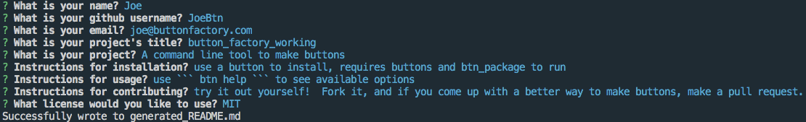
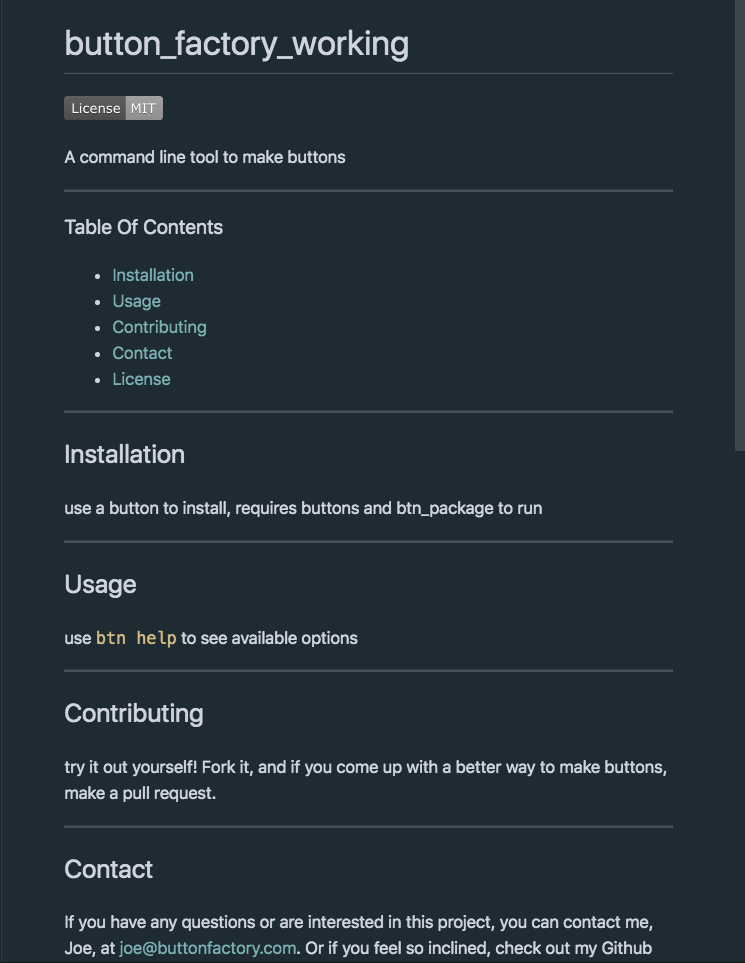

# readme_generator


A simple command line tool to make the creation of README files easier.

---
### Table Of Contents
 
* [Installation](#installation)
* [Usage](#usage)
* [Contributing](#contributing)
* [License](#license)
* [Contact](#contact)

---

## Installation
 
You will need [node.js](https://nodejs.org/) as well as the [inquirer package](https://www.npmjs.com/package/inquirer).  If you want to try it out for yourself, you will need to clone this repository and run it locally.

## Usage

The command
```
node index
```
 will start prompting the user for inputs to create the README.

You will be prompted for the following items:
* Name.
* Github Username
* Email
* Project/Repo Title
* Description
* Installation Instructions
* Usage Instructions
* Contribution Instructions
* Choosing a License from a list of a few.

It will generate a Markdown file filled in with that information.

The resulting file will be written to [generated_README.md]() in the local directory.

As an example, this input:


Will result in the following:
[](generated_README.md)


## Contributing

Feel free to offer feature requests and make your own forks to test things out.  If you come up with anything interesting, try making your own pull request.

## Contact

If you have any questions or are interested in this project, you can contact me, Chris Faux, at chrisfaux95@gmail.com.  Or if you feel so inclined, check out my Github profile: [chrisfaux95](https:/github.com/chrisfaux95).
    

## License

This project licensed under the [MIT](https://choosealicense.com/licenses/mit/) license.
